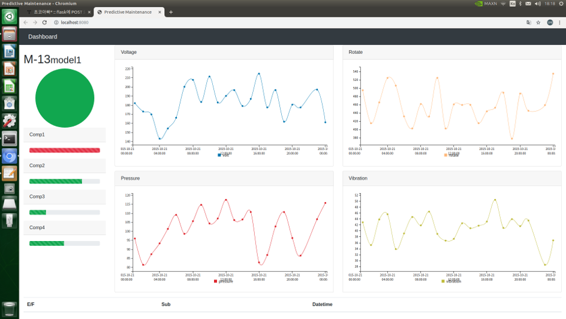
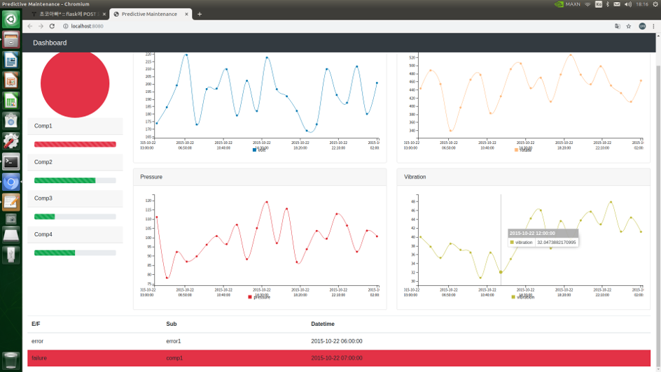
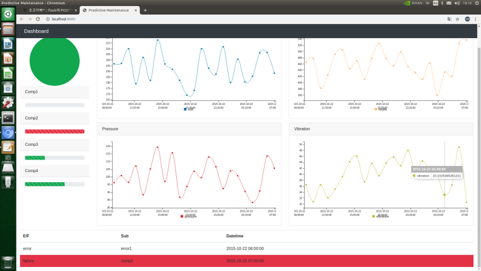
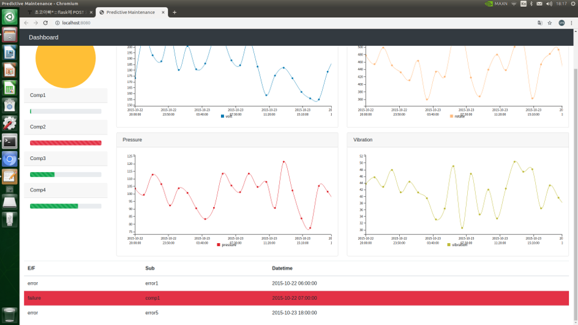

# PredictiveMaintenanceSolution  

2019년 2학기 기계학습 기말 프로젝트

---

## 팀 구성

#### 팀명 : Realization

---

## 개발 목적

- 실시간 센서 데이터와 장비 상태 정보들을 바탕으로 기계의 고장 가능성을 예측하여 기존의 유지보수 기법들보다 더 나은 효율을 보이고자 함

## 개발 목표

- 머신 러닝(Machine Learning)을 활용해서 실시간 센서 데이터와 기계 상태 값을 활용하여 향후 고장 가능성을 예측하는 고장 예측 분류 모델을 개발
- 고장 예측 결과를 사용자가 정보를 활용할 수 있도록 User-Friendly UI 구현

---

## 사용 기술

### Backend

- Pandas
- Scikit-Learn
- Flask
- Python

### Frontend

- jQuery
- Billboard.js
- Bootstrap
- HTML5
- javascript

---

## 개발 과정

### Data Pre-Processing

- Pandas를 활용해서 결측치, 이상치 등을 확인
- 매 정각마다의 상태 값을 24시간 평균치로 변환
- 데이터를 기계별로 분류하여 저장

### Make Model

- 다중클래스 분류(Multi-Class Classification)
Scikit-Learn 공식 문서 참조하여 모델 선정
- LogisticRegression, LinearSVC, RandomForest, GradientBoosting
- 각 모델에 대한 HyperParameter 튜닝
- 모델별 성능 비교(F1 Score) 후 모델 결정 및 pkl 저장

### User Interface - Dashboard

- Bootstrap UI
Bootstrap4 Framework Theme
- Realtime Graph
Billboard.js를 활용해 LineChart의 Flow 기능 구현

### Ajax

- Redirect 없고, POST 방식의 송수신 필요

---

## 개발 결과

- 실시간 센서 데이터 및 시스템 오류(Error) 파악 가능
- 향후 24시간 이내 기계의 고장(Failure)을 예측

### 동작 사진(정상)

### 동작 사진(고장 발생 예측시)

### 동작 사진(고장 발생 예측 -> 정상 예측)

### 동작 사진(시스템 에러 발생 시)

---

## 개선 방안

- 기계 1대에 대한 대쉬보드 기능만 제공하고 있으며, 여러 대의 기계에 대한 예측이 가능하도록 개선할 필요가 있음
- 차원 축소(Feature Compression)를 통해 모델의 복잡도를 낮출 필요가 있음
- 다중 클래스 분류 과정에서 데이터셋의 불균형(Imbalanced Data) 문제 해소 필요

---

## Reference

- [Microsoft Dataset](https://gallery.azure.ai/Experiment/Predictive-Maintenance-Modelling-Guide-Experiment-1)
- [Scikit-Learn](https://scikit-learn.org/stable/modules/multiclass.html)
- [Billboard.js](https://naver.github.io/billboard.js/)
- [Bootstrap]()

---

#### 최종 수정일

2019.12.26
